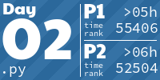
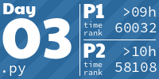

<h1 align="center">
  My Advent of Code Solutions
</h1>

<!-- AOC TILES BEGIN -->
<h1 align="center">
  2022 - 8 ⭐
</h1>

<!-- AOC TILES END -->

---

The graphic above has been created using [this](https://github.com/LiquidFun/adventofcode) tool. 

